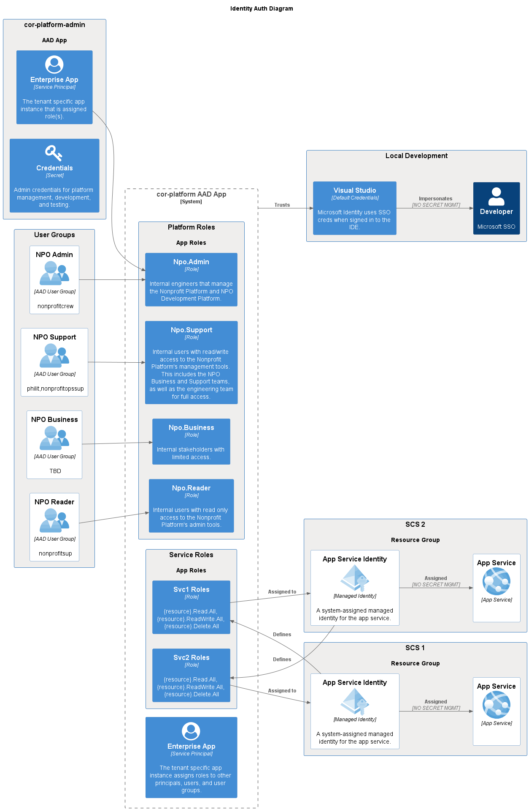
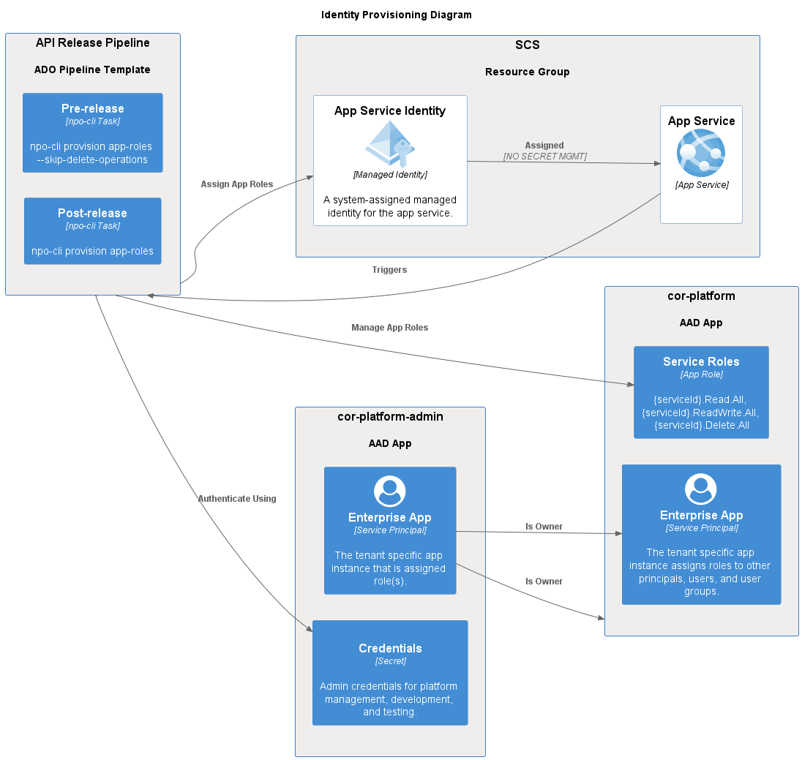
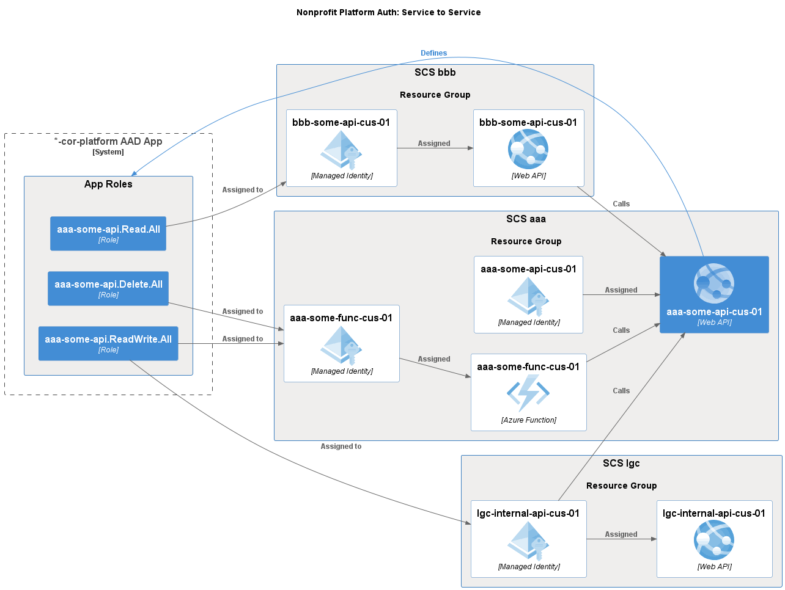

This post details authorization scenarios primarily for service to service authentication using Managed Identities in Azure.

## User Roles

| Role         | AAD User Group | Description                                                                                                                                                                          |
| ------------ | -------------- | ------------------------------------------------------------------------------------------------------------------------------------------------------------------------------------ |
| Admin        | Business Admin | Internal engineers that manage the Portal and Development Platform.                                                                                                                  |
| Reader       | Search Tool    | Internal users with read only access to the Development Platform's admin tools.                                                                                                      |
| Support      | System Admin   | Internal users with read/write access to the Development Platform's management tools. This includes the Business and Support teams, as well as the engineering team for full access. |
| Tenant Admin | Tenant Admin   | Client administrators who can access the Portal.                                                                                                                                     |
| Tenant User  | Tenant User    | Client end users who do not have access to any Development Platform functionality.                                                                                                   |

## Application Roles

- Defined by each project's [manifest.json](../architecture/project-manifest) file.
- DEV-CLI provisioning is executed during deployments to apply changes to role definitions and assignments
- Roles must be named with a prefix matching the project's `ServiceId` (`{Scs}-{Name}`)
- Roles can be assigned to any valid `ServiceId`

## Authentication System Diagram

## Provision App Role Automation

## S2S Auth

Daemon Dev Platform app authentication for calls to other Dev Platform APIs.

This is handled via `manifest.json` configuration specifying custom App Roles to be defined on the `*-cor-platform` AAD App and assigned to managed system identities for authorized applications.

Due to [24 hour identity token caching](https://learn.microsoft.com/en-us/azure/active-directory/managed-identities-azure-resources/managed-identity-best-practice-recommendations#limitation-of-using-managed-identities-for-authorization), **special care must be taken when modifying app role definitions**. [See this guide for details](../architecture/project-manifest#modifying-approles).

